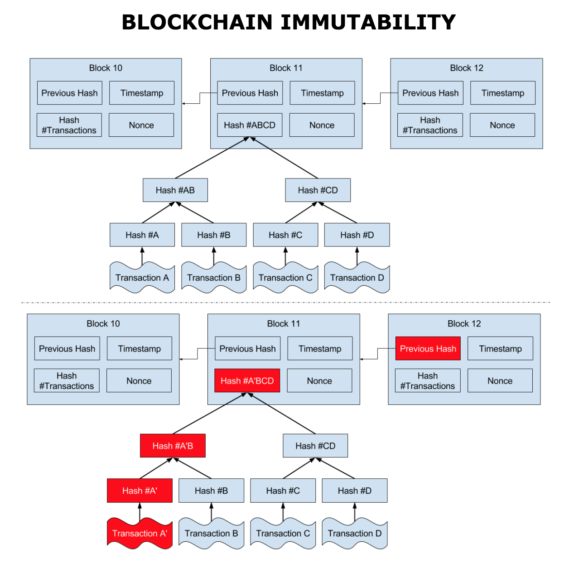

# Hyperledger

edX course [Blockchain for Business - An Introduction to Hyperledger Technologies](https://courses.edx.org/courses/course-v1:LinuxFoundationX+LFS171x+3T2017/course/)

People

* Brian Behlendorf
* Robert Schwentker
* Jeff Flowers

Authors of course

Robert, Alexandra, Arianna, Navroop & Nathalie

**Hyperledger** is umbrella open source project aimed at advancing cross-industry blockchain tech.

Will foucus on **Iroha**, **Sawtooth**, **Fabric**.

# Chapter 1. Discovering Blockchain Technologies

## Objectives

* Discuss blockchian and distributed ledger technologies (DLT)
* Explore permissioned and permissionless blockchains
* Discuss several components of distributed ledger technologies
* Provide high level explanation of Hyperledger

## Distributed ledger technologies

Past: In the beginning, hardware and software centralized in mainframes.

Present: Cloud computing enables decentralizing hardware, but applications are still centralied (trusted servers).

Future: Decentralized hardware and software.

**Distributed ledger**: Data structure residing across multiple devices.

**Distributed Ledger Technology**: Group of technologies that make a distributed ledger technologically bound, and which contribute in giving the ledger its properties. Examples: timestamping transactions, peer-to-peer networks, cryptography, shared computational power, consensus algorithm.

In general, modern distributed ledger technology includes

* A *data model* representing current state of the ledger
* A *language of transactions* for changing the ledger state
* A *consensus protocol* to determine how to interpret the data model and perform modifications on it.

**Blockchain**: A blockchain is a peer-to-peer distributed ledger forged by consensus, combined with a system for "smart contracts" and other assistive technologies.

**Smart Contracts**: Computer programs that execute predefined actions when certain conditions within the system are met.

**Consensus**: Consensus refers to a system of ensuring that parties agree to a certain state of the system as the true state.

Distributed ledger vs Blockchain: distributed ledger is a system whose purpose the synchronization of the data throughout its network. Blockchian is an example of a data structure that may be adopted by a distributed ledger.

According to edX, blockchain

> is a specific form or subset of distributed ledger technologies

Not sure I agree that the relationship between DLTs and blockchain by means of a *subset*. Either can exist independent of each other.

Blockchain description: technology that constructs a cronological set of blocks. Each block contains the transactions that block adds to the chain.

Blocks are related to each other and thus chained by means of timestamping combined with cryptographic hashes.

Blockchain blocks commonly consist of

* Reference to previous block
* Proof of work or nonce
* Timestamp
* Merkle tree root of transactions

**Merkle tree**: Data structure, aka binary hash tree, used to store hashes of individual data in large datasets. Efficient verification and tamper proof.

Andreas M. Antonopoulos (of Bitcoin protocol):

> Merkle trees are used to summarize all the transactions in a block, producing an overall digital fingerprint of the entire set of transactions, providing a very efficient process to verify whether a transaction is included in a block.

Blockchain describes what has happened in the past, it's a logging system. It is not a platform for business decisions, although business decisions may rely on a blockchain as a source of input.

**Transaction**: The record of an event, cryptographically secured, that is verified, ordered, and bundled into a block.

Cryptography plays a key role in the immutability of transactions.

Database vs Blockchain: blockchain is write-only data structure (not sure I agree with this) where blocks get appended and linked to the previous block with hashes. There's no editing or deleting of data. Relational databases allow for CRUD operations.

Permissionless blockchain: public blockchain, anyone can join

Permissioned blockchain: private blockchain, participants must be pre-approved

My interpretation: blockchain can only be written and read, not updated or deleted. All participants can both read and write. If you need to implement a ledger whose contents you do not want to make public, then you need a permissioned blockchain. Depends on whether you believe its in your best interest to allow third parties to view that information.

Should be driven by the particular application or use case.

Data on a blockchain can be considered immutable: extremely hard and prohibitively expensive (literally lots of energy/money) to change the past.

Vitalik Buterin:

> Cryptoeconomics is about building systems that have certain desired properties using cryptography to prove properties about messages that happened in the past while using economic incentives defined inside the system to encourage desired properties to hold into the future.

Ethereum provides Ether and Turing-complete virtual machine.

## Consensus algorithms

**Proof of work**: Solving computationally challenging puzzle. Hard to create, easy to verify. Like a combination lock. High latency, high energy consumption, susceptible to 51% attack.

**Proof of stake**: Nodes are known as validators, validate transaction in exchange for fee. No mining, all coins exist from day 1. Nodes randomly selected to verify blocks, probability of being chosen proportional to coins owned. Instances include Proof of Deposit and Proof of Burn.

**Proof of elapsed time**: Developed by Intel. Used in Hyperledger Sawtooth. Hybrid approach of random lottery and first-come-first-served. Each validator given random wait time. Validator with shortest wait time is the leader and gets to create the next block.

**Simplified Byzantine Fault Tolerance (SBFT)**: Version of Practical Byzantine Fault Tolerance (PBFT). Validator is known party (permissioned ledger). Other nodes must ratify result. There must be at least `2f+1` nodes ratifying a result in a network with `3f+1` nodes where `f` is the number of faults in order for the system to be Byzantine fault tolerant. **Permissioned**.

**Proof of Authority**: A group of nodes are considered authorities, and only they can create new blocks. They are also the only ones that can reach consensus.
